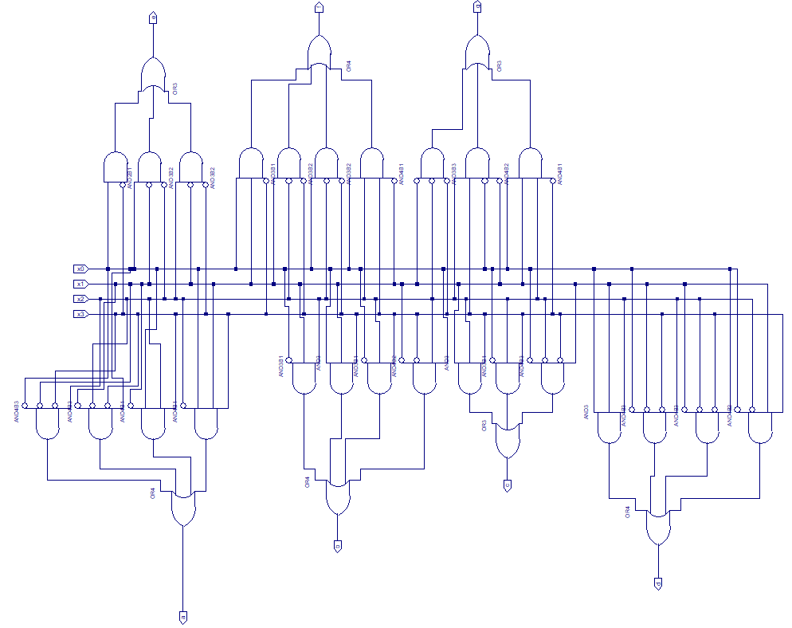
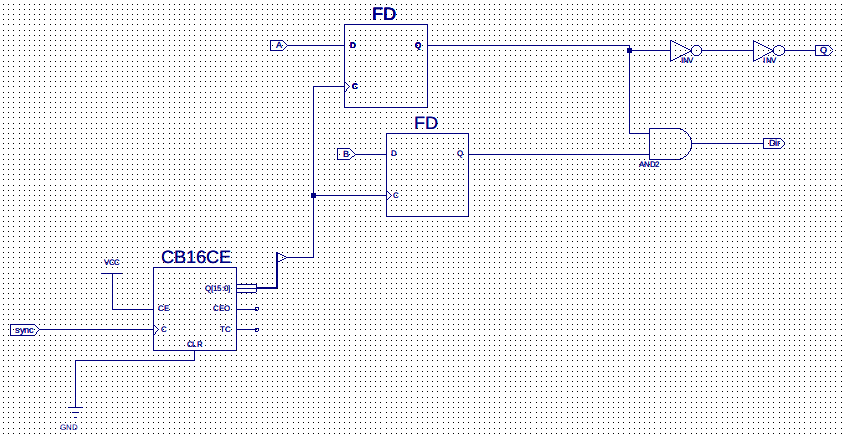
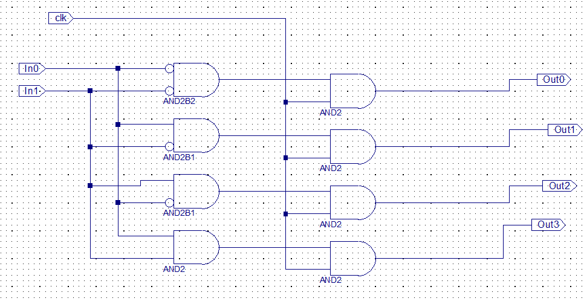

# Combination-Lock-on-FPGA

## Table of Contents
* [Technologies And Devices Used](#technologies-and-devices-used)
* [Diagram](#diagram)
  * [Main diagram](#main-diagram)
  * [Seven-segment display block](#Seven-segment-display-block)
  * [Bin to 7 segment display decode](#Bin-to-7-segment-display-decode)
  * [Four counters in one block](#Four-counters-in-one-block)
  * [Encoder](#Encoder)
  * [Demultiplexer](#Demultiplexer)

<!--
* [Project Status](#project-status)
-->

## Technologies And Devices Used
- Basys 2 Spartan-3E FPGA Trainer Board
- Xilinx ise 10.1
- Schematics Design

## Diagram
### Main diagram

### Seven-segment display block

### Bin to 7 segment display decode

### Four counters in one block

### Encoder

### Demultiplexer

<!--
## Project Status
Project is: in progress.

 ## Acknowledgements -->

